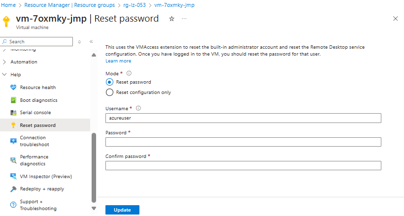

# Deploying AI Landing Zone

## Table of Contents

1. [Prerequisites](#1-prerequisites)  
2. [Quick start with azd](#2-quick-start-with-azd)  
3. [Accessing VMs](#3-accessing-vms)  
4. [Configuration options](#4-configuration-options)  
5. [Reference docs](#5-reference-docs)  
6. [Important notes](#6-important-notes)  
7. [CI/CD pipelines (overview)](#7-cicd-pipelines-overview)  

## 1) Prerequisites

* **Azure CLI** and **Azure Developer CLI** installed and signed in  
* A **resource group** in your target subscription  
* **Owner** or **Contributor + User Access Administrator** permissions on the subscription  

## 2) Quick start with azd

### Deployment steps

1. **Sign in to Azure**

   ```bash
   az login
   ```

2. **Create the resource group** where you're gonna deploy the AI Landing Zone Resources

   ```bash
   az group create --name "rg-aiml-dev" --location "eastus2"
   ```

3. **Initialize the project**

   In an empty folder (e.g., `deploy`), run:

   ```bash
   azd init -t Azure/AI-Landing-Zones -e aiml-dev
   ```

4. **Set environment variables** `AZURE_LOCATION`, `AZURE_RESOURCE_GROUP`, `AZURE_SUBSCRIPTION_ID`.

**Bash (Linux/macOS, WSL, Cloud Shell)**

```bash
export AZURE_LOCATION="eastus2"
export AZURE_RESOURCE_GROUP="rg-aiml-dev"
export AZURE_SUBSCRIPTION_ID="00000000-1111-2222-3333-444444444444"
```

**PowerShell (Windows/PowerShell Core)**

```powershell
$env:AZURE_LOCATION = "eastus2"
$env:AZURE_RESOURCE_GROUP = "rg-aiml-dev"
$env:AZURE_SUBSCRIPTION_ID = "00000000-1111-2222-3333-444444444444"
```

5. **(Optional) Customize parameters**

   Edit `bicep/infra/main.bicepparam` if you want to adjust deployment options. (See [Configuration options](#4-configuration-options) and [Reference docs](#5-reference-docs))

6. **Provision the infrastructure**

   ```bash
   azd provision
   ```

> [!NOTE]  
> Provisioning uses Template Specs to bypass the 4 MB ARM template size limit.
> Pre-provision scripts build and publish them, while post-provision scripts remove them after success.

> [!TIP]  
> **Alternative deployment with Azure CLI**: Clone the repo, set environment variables manually (e.g., `$env:VAR="value"`), run the pre-provision script, then use `az deployment group create` instead of `azd provision`. Remember to run the post-provision script after deployment.

## 3) Accessing VMs

> [!NOTE]  
> VM deployment is optional. This section applies only if you chose to deploy the Jump VM or Build VM during provisioning.

### VM Credentials

The template uses auto-generated random passwords by default for security. You can optionally provide custom passwords (or SSH keys for the Linux Build VM) as parameters during deployment.

**Default usernames:**
- Jump VM (Windows): `azureuser`
- Build VM (Linux): `builduser`

### Resetting Passwords

If you used auto-generated passwords (default), reset them through the Azure Portal before connecting:

1. Navigate to the VM resource
2. Go to **Help** → **Reset password**
3. Enter the username and your new password
4. Click **Update**



### Connecting to VMs

- **Jump VM (Windows)**: Azure Bastion or RDP
- **Build VM (Linux)**: SSH

Both VMs provide access to resources within the virtual network.

## 4) Configuration options

Update parameters in the `bicep/infra/main.bicepparam` file:

```bicep
using 'main.bicep'

param location = 'eastus2'
param baseName = 'myailz'
param deployToggles = {
  acaEnvironmentNsg: true
  agentNsg: true
  apiManagement: true
  ...
  storageAccount: true
  virtualNetwork: true
  wafPolicy: true
}
param resourceIds = {}
param flagPlatformLandingZone = false
```

The template supports flexible deployment patterns through parameter configuration:

### Platform Integration

* **Standalone mode**: Creates all networking and DNS resources
* **Platform-integrated mode**: Reuses existing platform DNS zones and networking

### Resource Reuse

* **New resources**: Template creates all components from scratch
* **Existing resources**: Reuse components via `resourceIds` parameter
* **Hybrid**: Mix of new and existing resources as needed

### AI Foundry Options

* **Full setup**: AI Foundry with all dependencies (Search, Cosmos DB, Key Vault, and Storage)
* **Project only**: AI Foundry project only (no Agent Service or dependencies)
* **Custom models**: Configure specific AI model deployments


## 5) Reference docs

For detailed configuration and examples, see:

* **[Parameters](./parameters.md)** — Complete parameter reference
* **[Defaults](./defaults.md)** — Default values for all input parameters
* **[Examples](./examples.md)** — Common deployment scenarios


## 6) Important notes

* **Naming**: If you leave names blank, the template generates valid names from the `baseName` parameter
* **Global resources**: Storage accounts and Container Registry require globally unique names
* **Platform integration**: Set `flagPlatformLandingZone = true` to integrate with existing platform DNS zones
* **VM deployment**: Build/Jump VMs only deploy when required parameters are provided (SSH keys, passwords)

## 7) CI/CD pipelines (overview)

Basic automation can be added later via `azd pipeline config`, which scaffolds either a GitHub Actions workflow or an Azure DevOps pipeline and sets up identity (OIDC) plus required variables. For deeper guidance, refer to the official docs: [https://learn.microsoft.com/azure/developer/azure-developer-cli/configure-devops-pipeline](https://learn.microsoft.com/azure/developer/azure-developer-cli/configure-devops-pipeline)

Minimal workflow:

```bash
azd pipeline config
```

This is usually enough for most teams to get a provisioning pipeline started; customize retention, approvals, and promotion flows in your organization’s standard DevOps process.

